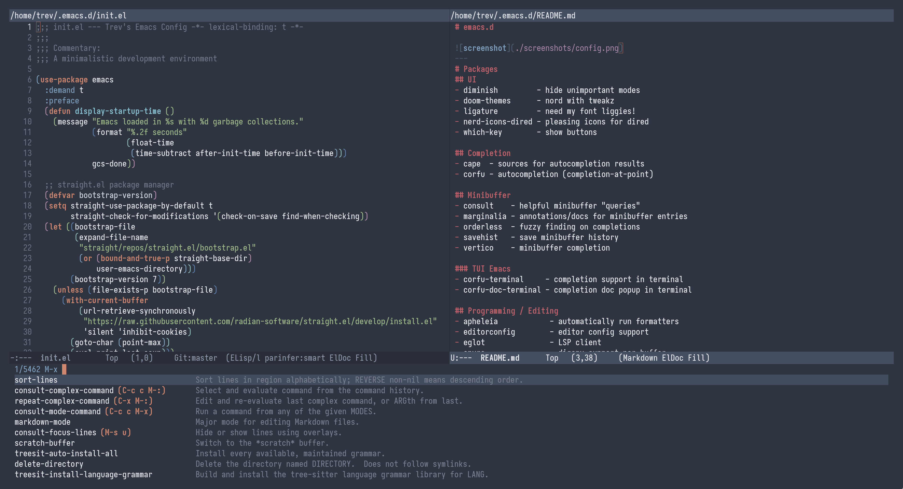

# emacs.d

---
# Packages
## UI
| Package          | Description              |
|------------------|--------------------------|
| diminish         | Hide unimportant modes   |
| ligature         | Need my font liggies!    |
| nerd-icons-dired | Pleasing icons for dired |
| which-key        | Show buttons             |

## Completion
| Package | Description                          |
|---------|--------------------------------------|
| cape    | Sources for autocompletion results   |
| corfu   | Autocompletion (completion-at-point) |

## Minibuffer
| Package    | Description                             |
|------------|-----------------------------------------|
| consult    | Helpful minibuffer "queries"            |
| marginalia | Annotations/docs for minibuffer entries |
| orderless  | Fuzzy finding on completions            |
| savehist   | Save minibuffer history                 |
| vertico    | Minibuffer completion                   |

## Programming / Editing
| Package            | Description                                         |
|--------------------|-----------------------------------------------------|
| format-all         | Automatically run formatters                        |
| editorconfig       | Editor config support                               |
| eglot              | Lsp client                                          |
| envrc              | Direnv support per-buffer                           |
| rainbow-delimiters | Help me see matching parens!                        |
| ws-butler          | Remove extra whitespace                             |

### Languages 
| Package       | Description  |
|---------------|--------------|
| geiser-guile  | Guile Scheme |
| markdown-mode | Markdown     |
| rust-mode     | Rust         |
| sly           | Common Lisp  |

### Treesitter
| Package      | Description                               |
|--------------|-------------------------------------------|
| treesit      | Treesitter                                |
| treesit-auto | Automatically install Treesitter grammars |

## Version Control (Git)
| Package   | Description                   |
|-----------|-------------------------------|
| diff-hl   | Show changes in buffer margin |
| git-modes | Various modes for git files   |
| magit     | Git GUI                       |

## Control / Quality of Life
| Package         | Description                          |
|-----------------|--------------------------------------|
| ace-window      | Easy movement between windows/splits |
| avy             | Navigate buffer like a sniper        |
| helpful         | Enhanced help pages                  |
| undo-fu         | Better undo                          |
| undo-fu-session | Persist undos between restarts       |

## Programs / Fun
| Package  | Description                    |
|----------|--------------------------------|
| elfeed   | RSS/Atom feed reader           |
| erc      | IRC client                     |
| leetcode | Leetcode problems inside emacs |
| vterm    | Virtual terminal within emacs  |
